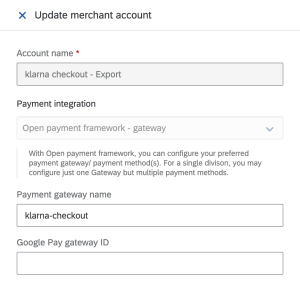
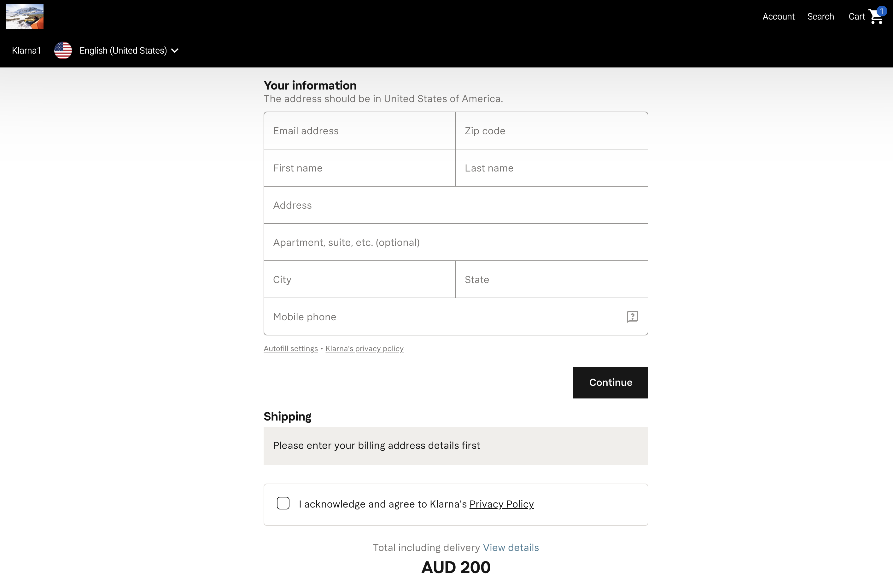

# Klarna Checkout: Sample Native Extension

[](https://api.reuse.software/info/github.com/SAP-samples/upscale-commerce-open-payment-integration)

## What is it?
The Klarna checkout custom component is a sample of what will be possible with our brand new overhaul of the existing custom component implementation. The existing solution is only capable of injecting iframes into an Upscale PWA. The new version of custom components, which we are calling native extensions, will be capable of injecting native angular components and services directly into an application. In addition to being visible to web-crawlers, these components will be able to interact directly with the PWA’s front end state and services, enabling the merchant to build essentially anything that an Upscale developer could.

To make it easier for a merchant to create a native extension, we have created a new public-facing upscale-web-storefront-sdk containing abstract classes which the component can access. The implementations of these classes exist as part of the PWA, and when the component is loaded, any references to them resolve to the implementations in the PWA. Those services interact with the PWA state, and are what enable much of the complex functionality that a merchant would want. The component can also access our caas-service-client-angular which provides services that interface directly with the back end services, for more fine-grained control.

## Setting up the Custom Component
Follow the steps below to create your own version of the klarna-checkout native component:

1. Download 
The klarna-checkout native component code lives in the [SAP-samples Github](https://github.com/SAP-samples/upscale-commerce-open-payment-integration). Download the repository as a zip file and extract it.

2. Configure mapping
Find the folder containing the klarna-checkout source. Open the klarna-checkout.component.ts file in your desired IDE/text editor. You can find it in the path: projects/klarna-checkout/src/lib/klarna-checkout.component.ts.

Take note of the following code starting on line 110: 

    
    const klarnaConfig = configs.find((config) => {
    return config.gatewayProviderName === 'klarna-checkout';
    });
    
  
This code is checking for a payment configuration with a gatewayProviderName matching "klarna-checkout". Feel free to change this string to something else, so long as it is consistent with that of a compatible payment configuration (more on this later).

3. Component mapping
Open klarna-checkout.module.ts located in the same directory.

Take note of the following code starting on line 10:

    
    this.registrationService.register(
      'klarna-checkout',
      KlarnaCheckoutComponent
    );
    
This code is mapping the KlarnaCheckoutComponent component class to the string "klarna-checkout". The registrationService is a service which is shared between the PWA and the custom component, and essentially by providing this mapping, we are telling the PWA that this component exists. Like the gatewayProviderName property above, feel free to set this string to anything you like as well.

4. Publish Component Library
Open the klarna-checkout folder in terminal and execute commands to install all dependencies, build, and package the application.

Note: For the current release, neither upscale-web-storefront-sdk nor caas-service-client-angular will not be available publicly. As such, you'll need to reference them from an existing Upscale PWA whose dependencies have been installed.

    
    npm install
    npm install --save-dev <path to Upscale PWA>/libs/caas-service-client-angular-<version>.tgz
    npm install --save-dev <path to Upscale PWA>/libs/upscale-web-storefront-sdk-<version>.tgz
    npm run build
    npm pack
   
Host the generated tarball (.tgz) or dist folder of the component library in a public environment such as NPM, GitHub, or S3.

5. Create Native Extension
Add the library as a Native Extension within the workbench, similarly to how you would a style extension.
 

6. Assign Native Extension
In order to add the library to an app where you wish to show the klarna checkout, select the extension name in the selectize field for extensions within the app configuration.
 

Note: You'll need to download the app to actually see the changes.

7. Configure Experience
Navigate to the experience editor for the experience associated with the app. You will need to remove the existing checkout component within the checkout template and replace it with a custom component.

In the custom component configuration, there is a dropdown for selecting either iframe or native component. Select native and then enter a string for the component identifier corresponding to mapping done in klarna-checkout.module.ts. 
 

8. Payment Configuration
Before the component can be used, you will need to configure a gateway or payment method with a compatible klarna script and assign it to the division associated with the app.

A postman collection to quickly setup one of these should be accessible via the [SAP-samples Github](https://github.com/SAP-samples/upscale-commerce-open-payment-integration). Instructions on how to install a payment configuration using a postman collection can be found [here](https://github.com/SAP-samples/upscale-commerce-open-payment-integration/tree/main/postman/klarna/iframe).

Please also be sure to fill in your config's gatewayProviderName (labelled as "Payment gateway name") as the string specified in klarna-checkout.component.ts above.
 

## Testing
If all the above setup is complete, please follow the steps below to test your new custom component!

1. Download the app

2. Extract the contents of the zip

3. Access the project root in terminal and run:

    ```sql
    npm install
    npm start
    ```
4. Access the application via localhost:4200, add a product to cart, and proceed to checkout. A klarna payment form should appear in the place of the regular checkout! 
 

## How it all works
The Klarna Checkout component makes use of the aforementioned front end services made available by upscale-provided dependencies; upscale-web-storefront-sdk and caas-service-client-angular, as well as some provided by angular itself.

Refer to [Klarna Checkout component](https://github.com/SAP-samples/upscale-commerce-open-payment-integration/blob/main/postman/klarna/iframe/How%20Klarna%20Checkout%20Component%20Works.docx) for details.

## License
Copyright (c) 2021 SAP SE or an SAP affiliate company. All rights reserved. This project is licensed under the Apache Software License, version 2.0 except as noted otherwise in the [LICENSE](LICENSES/Apache-2.0.txt) file.
