# Configuration with Postman Collection: APM via Adyen in Hosted Fields UX Pattern

## Purpose of this document
This document can be used for configuring Adyen Hosted Fields with APM.

The postman collection source is Gateway Stage system，and the target could be stage environment or other tenants.

## Set up Adyen Gateway
Follow the instructions in the Help Center to set up the gateway.

[Setting Up Gateway - SAP Help Portal](https://help.sap.com/viewer/a99d6fa0606f4f3cbf251e4e61f35feb/SHIP/en-US/c531853888f24325a7fb1a5b1b8f404e.html) 

## Export postman collection from Source System (Stage)

### Overview
After development implementation, the merchant account configuration is done in the gateway stage system. You can then export the postman collection scripts from the gateway stage system, and adjust them with the correct parameter values, and import them to the target tenant environment.

### Download Postman Collection Steps (optional)
1. In the gateway stage environment, go to Settings ->Payment.
2. Open the merchant account Adyen Hosted Field APM.
3. Export the postman collection from the gateway stage system.
4. A zip file with the name Upscale_Payment_Mapping_Configuration.zip will be exported.

### Directly copy the Postman Collection files to your local drive

[Postman Collection scripts](https://github.com/SAP-samples/upscale-commerce-open-payment-integration/tree/main/postman/adyen/hosted-fields) 

## Create Merchant Account in Target Tenant
1. Log on to the target tenant.
2. Create a merchant account.

 
3. In the new quick creation page above, make sure the Payment Integration is set to Open payment framework – gateway.
4. Enter the Payment gateway name. Note that if Google pay is integrated, you need to provide the exact gateway ID in Google pay.
5. Assign the division.
6. For the alternative payment method assignment, you can make the assignment once an alternative payment method is created.

## Create Payment Methods in Stage

### Purpose
In this configuration, these payment methods are supported via gateway Adyen in Hosted Field UX pattern.

### Steps
1. Go to your merchant account in Adyen Portal, and configure Payment Methods for your account.
 
2. Then, navigate to Settings ->Payment in Upscale Workbench.
3. Go the Alternative Payment Method tab, and create an Alternative payment method (APM).
4. In the APM creation page, specify the following:
- APM code:  It is one identifier of one method and just needs to be unique on Upscale side. Mapping from provider to Upscale will be done to make sure the method code of provider can be linked to Upscale side.
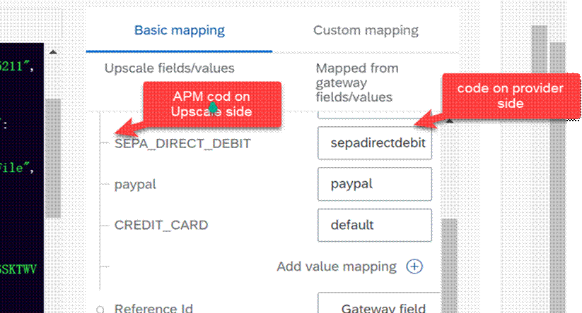 
- Specify an APM name.
- Set APM Type.
- Set the Settlement Method per the documentation.
- Consumer facing assets: specify the APM display name.
Some APM configuration examples:
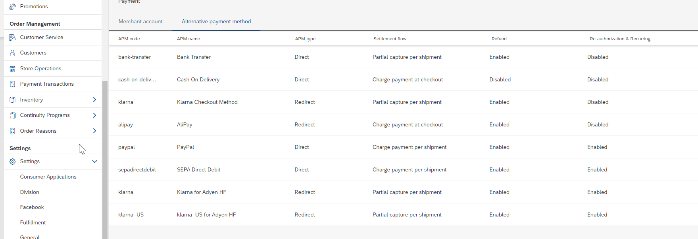 
5. Go back to your merchant account to assign the APM with the one you just created.
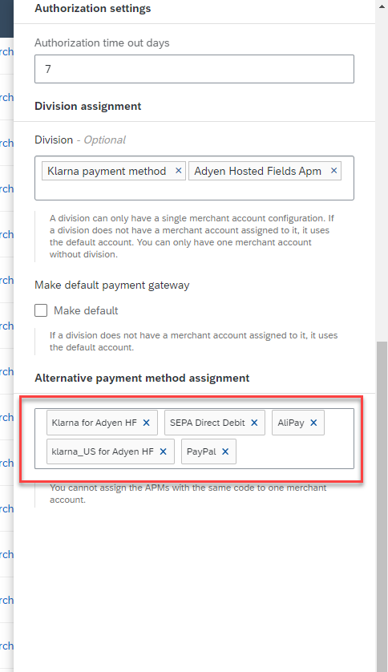 

## Configure the Merchant Account Just Created

### Steps
1. Navigate to the Merchant account tab, and locate the target merchant account, and click Configure.
 
2. Specify the merchant ID, which is the merchant ID from your Adyen merchant account that is used to take payments.
 
Note: To get the Merchant account, log in to Adyen Portal and get the merchant Account code. 
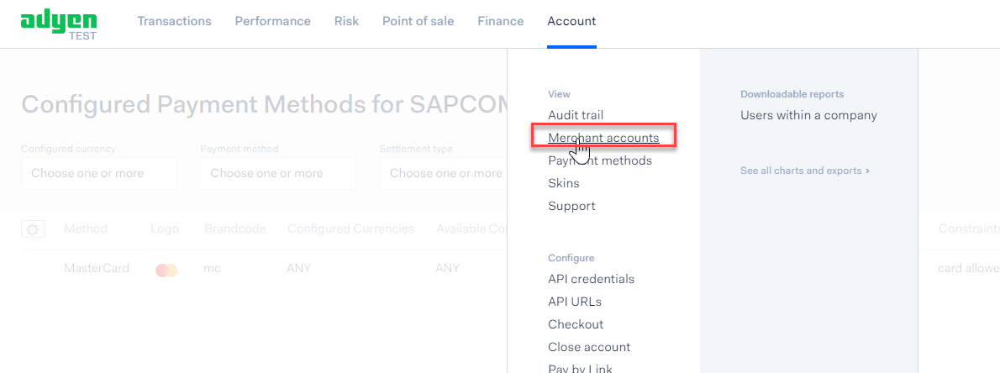 
3. After entering and saving the Merchant ID, the account group and account ID are generated and shown in the URL.
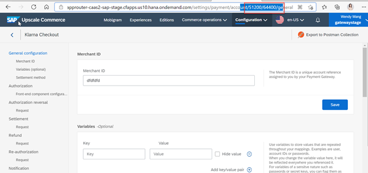 
4. Copy the account group ID and account ID, which will be used in your Postman collection.

## Configuration in Adyen Portal

### Steps
1. Log on to Adyen Portal.
2. Go to Webhooks to configure webhook.
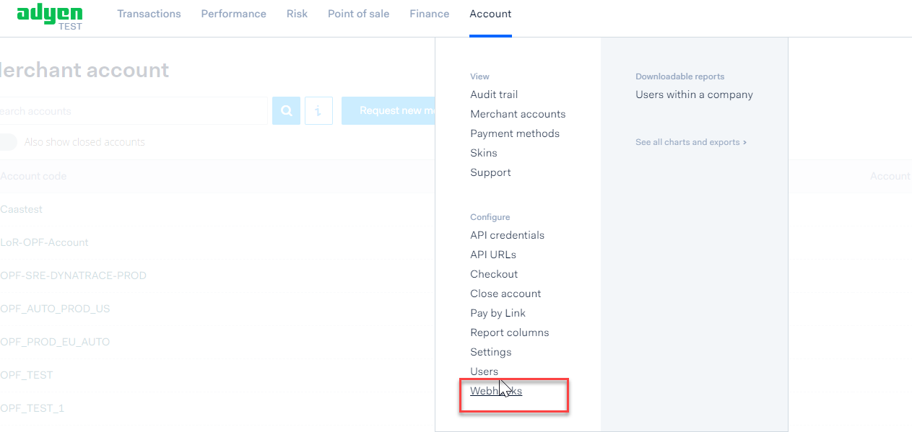 
   - Add Standard Notification. 
   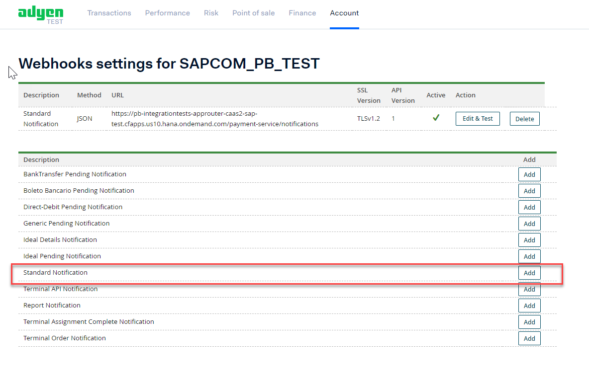 
   - Enter the URL that receives the notifications. To get the URL, log on to Upscale, go to the Notification General section of your merchant account, copy the URL for notification as shown below.
    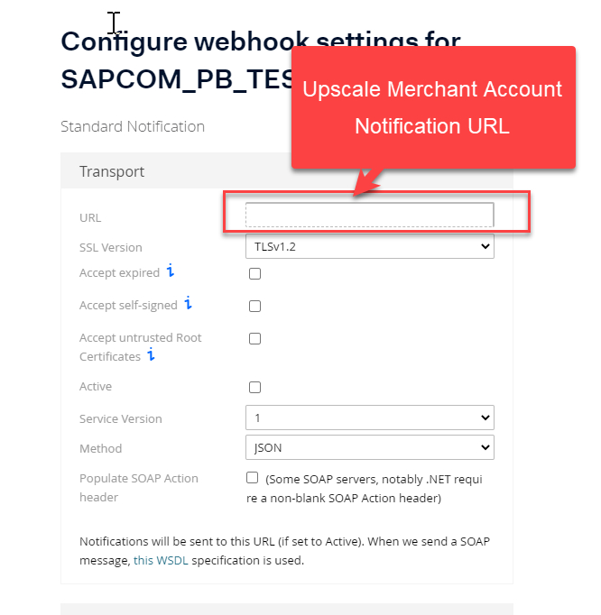 
     
   - Set up the basic authentication, and note down the basic authentication user name, password, which will be used in postman collection.  be sure to void space to the user name. 
    
   - Generate the HMAC key, you should note it down right at the time you generate the key, which will be used as an input in Postman collection environment variable. 
   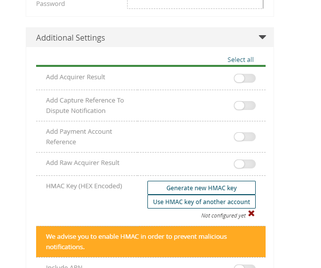 
   - Make sure you set the configuration to Active. Otherwise, the order in Upscale will always be in Pending status. 
      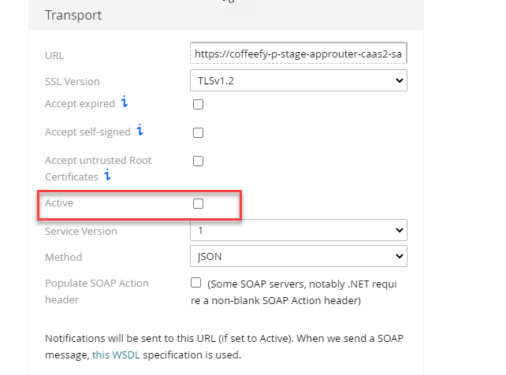 
   - Save the changes.
   - Test the configuration by clicking the Test configuration link, if it's 401, make sure the basic authentication credential  and HMAC are correct.
3. Configure web service users. 
   - Go to API credentials.
    
   - Generate API Key if you don't have one, note down the API Key and Client Key.
   
   Note: Once the API Key is generated, change it only when necessary, as this API key might be shared by different merchant accounts, you have to make sure the API Key is updated in all the corresponding areas. 
   - Add your PWA application as allowed origins. If it is not configured,  an error message will show invalid origin when selecting credit card.
   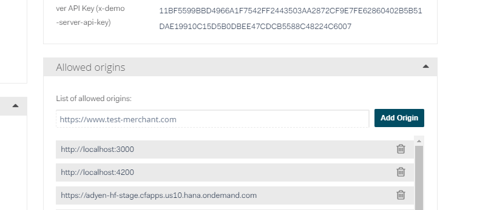

## Edit and execute the Postman Collection

### Steps
1. Extract the Postman collection zip file. It is recommend to edit both of the files, and change the names so that you can easily identify them in Postman.
2. Open the Postman.
3. Import the two files at the same time to Postman.

4. Edit the value of the variables 
   - Token: Refer to [Making Authorized API Calls](https://help.sap.com/viewer/DRAFT/7a1f60b8170f40cfb8313c49bdc7fd13/DEV/en-US/446a3d417aac4bd8a301464670995ed3.html) 
   - RootUrl example: (https://gatewaystage-approuter-caas2-sap-stage.cfapps.us10.hana.ondemand.com) (The target tenant where you created the merchant account.)
   Note: when coping the URL, remember to delete the “/” in the end.
   - Account group ID
   - Account ID
   
   - (Notification Basic Auth)Adyen Hosted Field_username, (Notification Basic Auth)Adyen Hosted Field_password (See the screenshot below.) 
   - (Notification HMAC)Adyen Hosted Field, the one you have noted down. It cannot be copied from Adyen once generated, you have to note it down right after the generation. (See the screenshot below from Adyen.)
   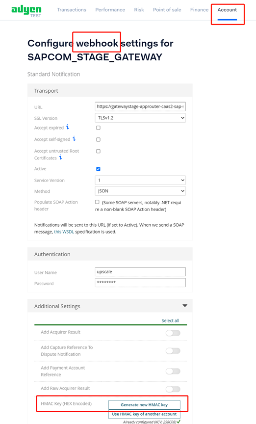
   - (Webservice User)Adyen Hosted Field
   
   - clientKey
   
   - capturePattern: The capture pattern for the upscale payment account. Select one of the following, Adyen supports partial capture.
     - PARTIAL_CAPTURE
     - CAPTURE_PER_SHIPMENT
     - AUTO_CAPTURE
   - authorizationTimeoutDays: The authorization timeout days for the upscale payment account.
5. Save and run the Postman collection.

## Additional Notes
If you delete the merchant account, the linked APM is also deleted. 

## License
Copyright (c) 2021 SAP SE or an SAP affiliate company. All rights reserved. This project is licensed under the Apache Software License, version 2.0 except as noted otherwise in the [LICENSE](LICENSES/Apache-2.0.txt) file.
