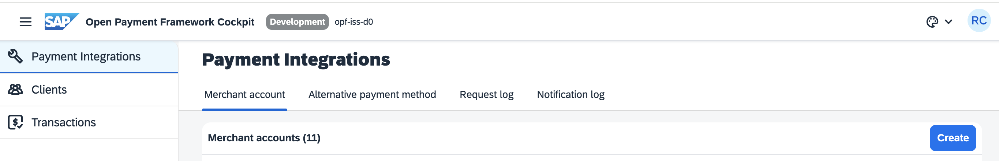
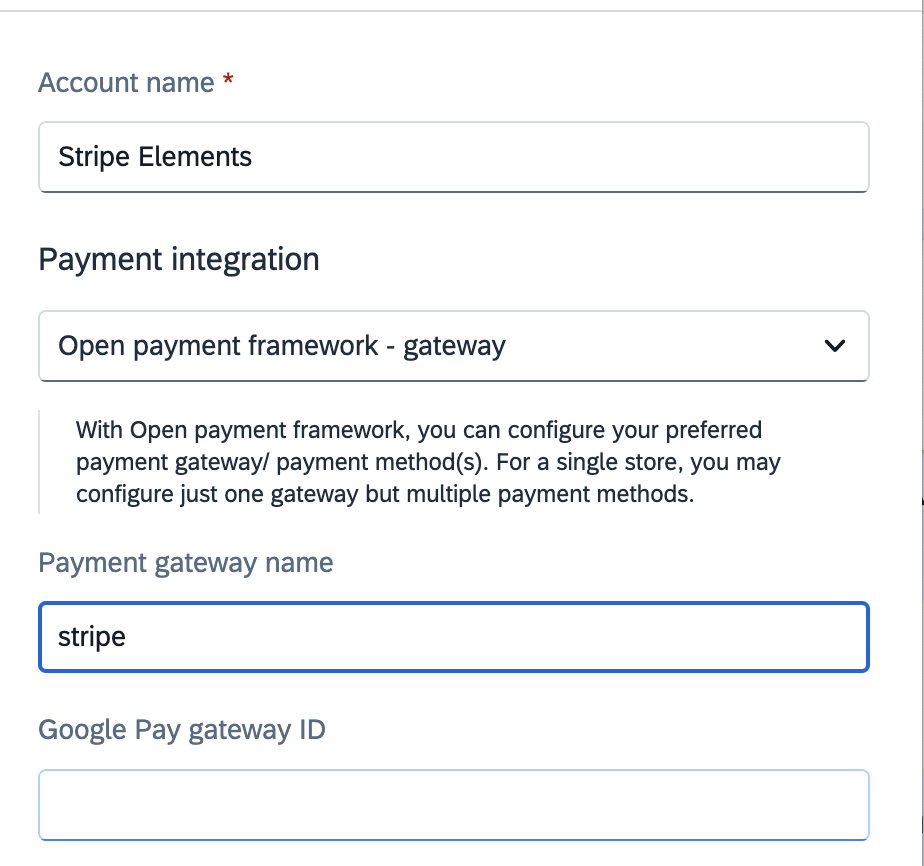
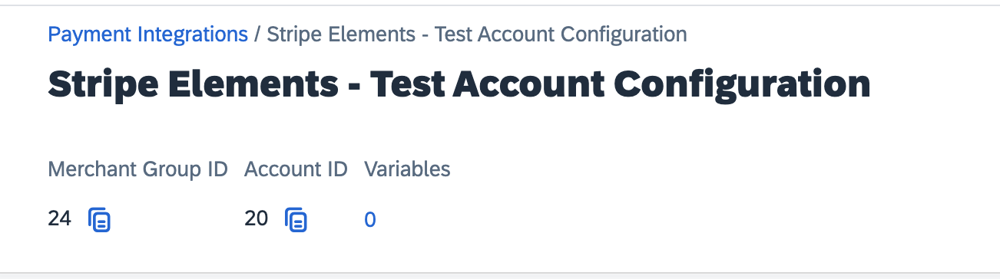
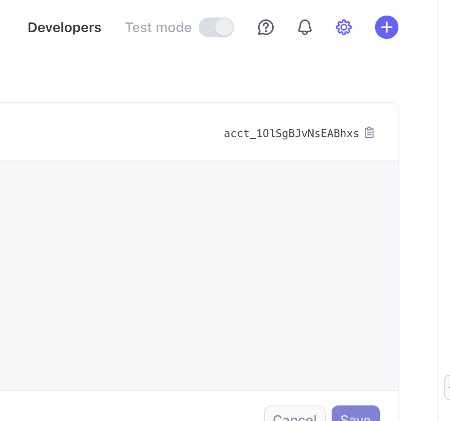
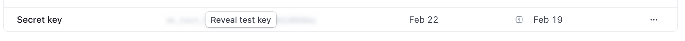
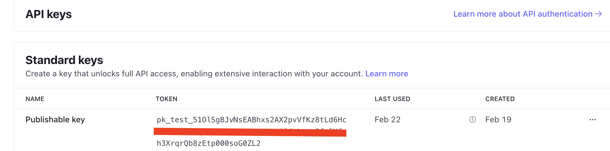
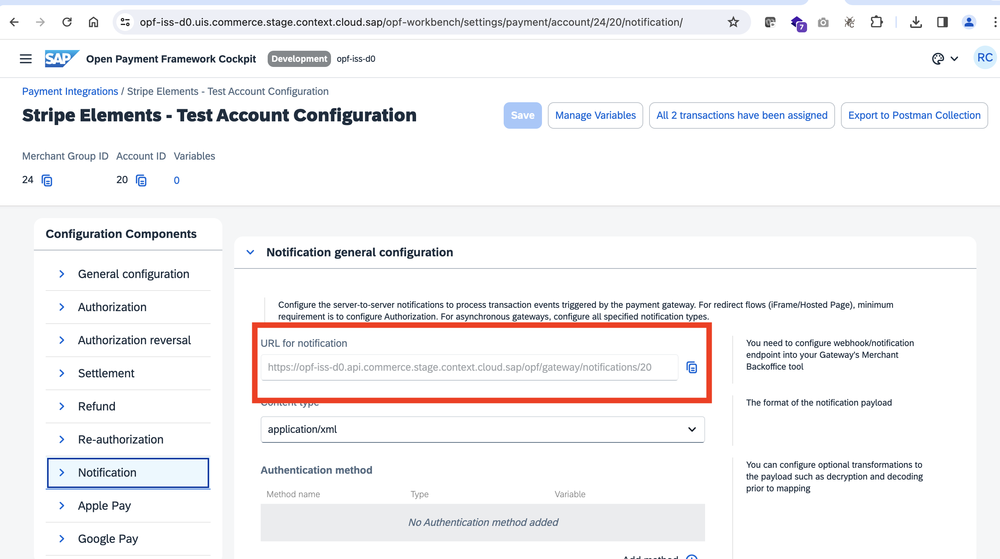
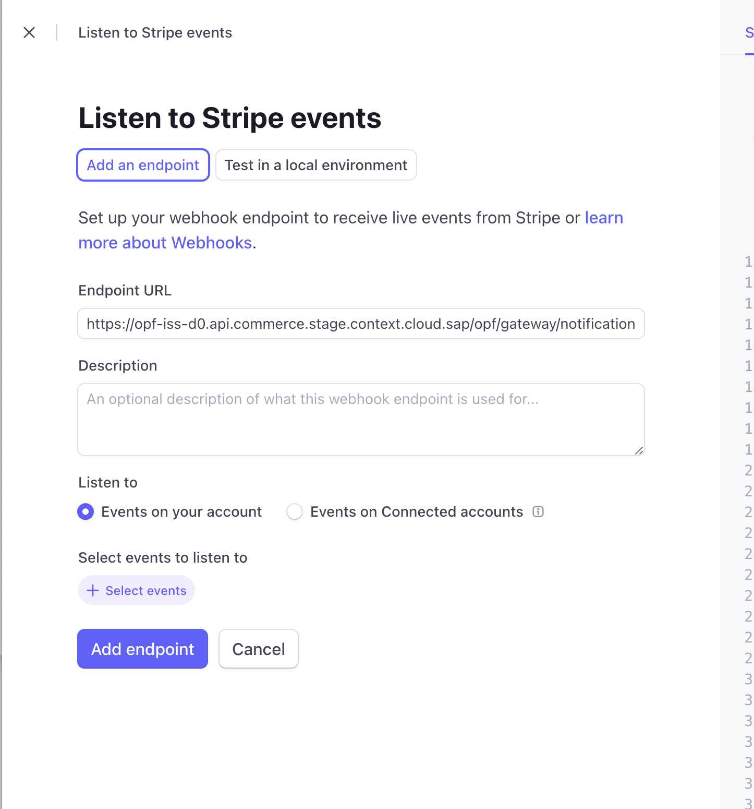
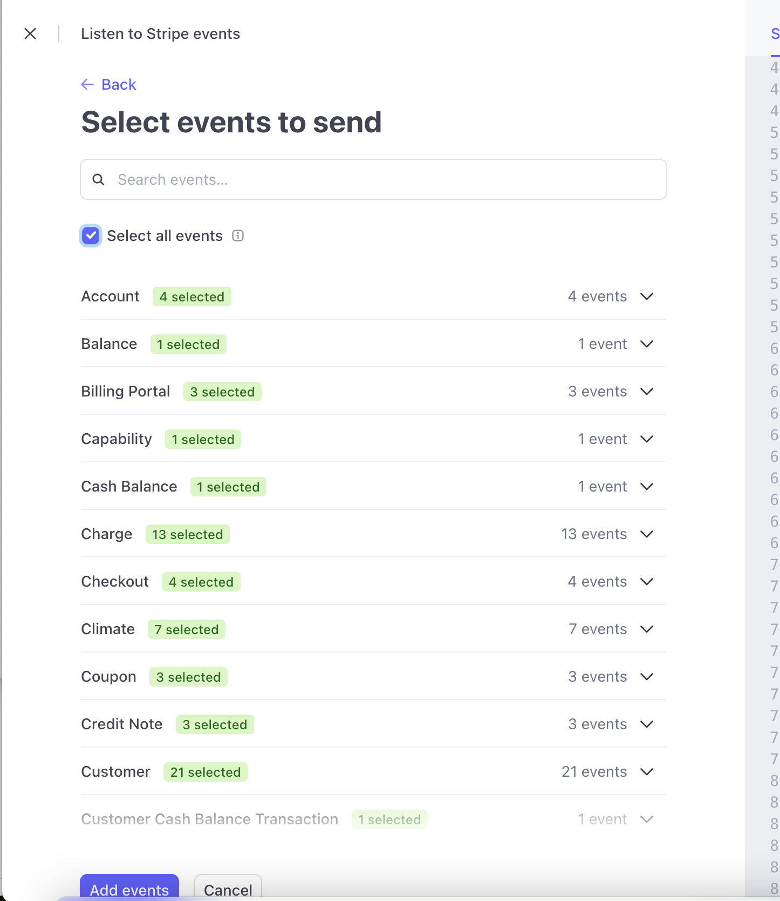
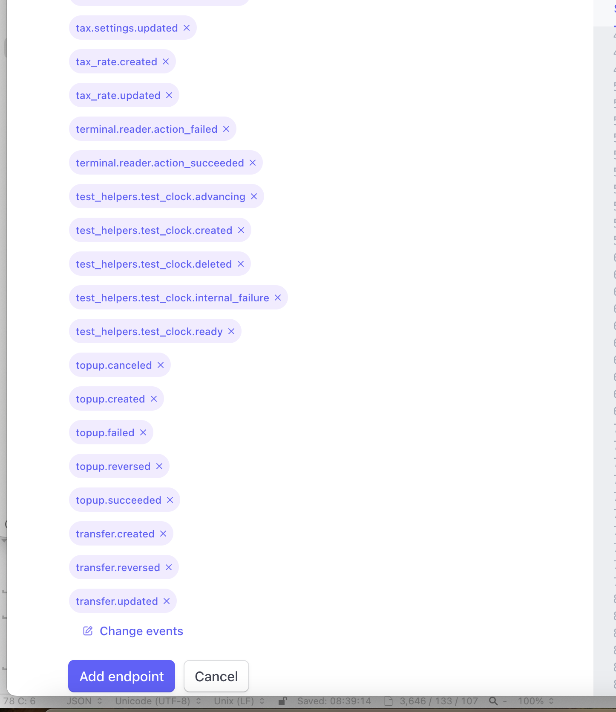

## Creating the Merchant Account Group to import Stripe Elements collection into

i) In payment integrations.. click Create

ii) Add account name (can be anything) and set payment gateway to stripe

iii) Click **configure** on Test column of newly created Account.

**You must set a merchant ID first.**

Merchant ID: You can obtain from your account id found here in the Stripe dashboard <https://dashboard.stripe.com/settings/account>

## Preparing the Postman environment_configuration file

**Token**

Gert your access token using the auth endpoint https://{{authendpoint}}/oauth2/token and client id and secret obtained from BTP Cockpit

Copy the value of the access_token field (it’s a JWT) and set as the **token** value in the environment file.

IMPORTANT: Ensure the value is prefixed with **Bearer**. e.g. Bearer {{token}}

**Root url**

The **rootUrl** is the **BASE URL** of your OPF tenant

E.g. if your workbench/OPF cockpit url was this …

<https://opf-iss-d0.uis.commerce.stage.context.cloud.sap/opf-workbench>

The base Url would be

[https://opf-iss-d0.uis.commerce.stage.context.cloud.sap](https://opf-iss-d0.uis.commerce.stage.context.cloud.sap/opf-workbench)

**Account and Account Group**

The **account** and **accountGroupId** values identify the merchant account group can be found in the top left of your merchant configuration

**Private Key**

The Secret (or Private) Key can be obtained here in the dashboard. In test it starts with **sk_test**

<https://dashboard.stripe.com/test/apikeys>

Set private key as **value** for environment variable keys starting with the pattern

**authentication_outbound_basic_auth_username\***

Set password as **empty string (“”)** for environment keys starting with :

**authentication_outbound_basic_auth_password\***

There should 2 occurrences of both in the environment file.

**Public Key**

The public (or Publishable) key can be obtained here in the dashboard. In Test it starts with **pk_test**

<https://dashboard.stripe.com/test/apikeys>

Replace the **publickey** variable value in the environment file with this value starting with **pk_test**

**Webhook Secret**

IN OPF cockpit: For your new merchant account Navigate to Notification General and copy the Notification URL

In Stripe Dashboard: Navigate to <https://dashboard.stripe.com/test/webhooks> and click Add an Endpoint

i) Paste in your endpoint URL copied from OPF

ii) For simplicity Select “All events”

iii) click Add Endpoint

iv) Click Reveal the get the webhook secret, it starts with **whsec**

In the Environment file set the **webhookSecret** value to the key starting with **whsec_**

**Summary**

The file is now ready for adding to postman.

In summary you should have edited the following variables

- **token**
- **rootUrl**
- **accountGroupId**
- **accountId**
- **2 x authentication_outbound_basic_auth_username_export\*** (e.g. authentication_outbound_basic_auth_username_export_52)
- **2 x authentication_outbound_basic_auth_password_export\*** (e.g. authentication_outbound_basic_auth_password_export_52)
- **publickey**
- **webhookSecret**
