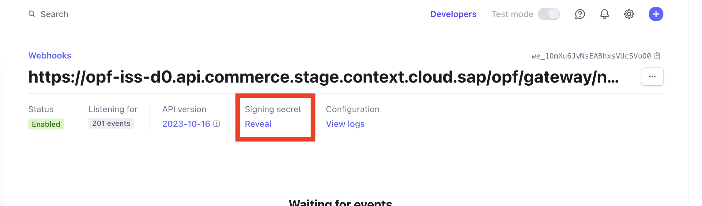

## Create a Stripe Account ##
You can Signup for a free Stripe Test Account at https://dashboard.stripe.com/register.

## Creating the Merchant Account Group 
To import the [Stripe Configuration](Stripe elements - HOSTED_FIELDS - CAPTURE_PER_SHIPMENT - OPF_Provider_Configuration.json) you need to create a new Account Group in the OPF Workbench.

i) In payment integrations.. click Create

ii) Add account name (can be anything) and set payment gateway to stripe

iii) Click **configure** on Test column of newly created Account.

**You must set a merchant ID first.**
You can obtain from your account id found at the following location in the Stripe dashboard <https://dashboard.stripe.com/settings/account>

## Preparing the Postman environment_configuration file

**1. Token**

Get your access token using the auth endpoint https://{{authendpoint}}/oauth2/token and client id and secret obtained from BTP Cockpit

Copy the value of the access_token field (it’s a JWT) and set as the ``token`` value in the environment file.

IMPORTANT: Ensure the value is prefixed with **Bearer**. e.g. ``Bearer {{token}}``

**2. Root url**

The ``rootUrl`` is the **BASE URL** of your OPF tenant

E.g. if your workbench/OPF cockpit url was this …

<https://opf-iss-d0.uis.commerce.stage.context.cloud.sap/opf-workbench>

The base Url would be

https://opf-iss-d0.uis.commerce.stage.context.cloud.sap

**3. Account and Account Group**

The ``accountId`` and ``accountGroupId`` values identify the merchant account group can be found in the top left of your merchant configuration

**4. Private Key**
The Secret (or Private) Key can be obtained here in the Stripe dashboard. In test it starts with **sk_test**

<https://dashboard.stripe.com/test/apikeys>

* Set private key as **value** for environment variable keys starting with ``authentication_outbound_basic_auth_username``
* Set password as **empty string** ``""`` for environment keys starting with : ``authentication_outbound_basic_auth_password``

There are 2 occurrences of both in the environment file.

**5. Public Key**

The public (or Publishable) key can be obtained here in the Stripe dashboard. In Test it starts with **pk_test**

<https://dashboard.stripe.com/test/apikeys>

Replace the ``publickey`` variable value in the environment file with this value starting with **pk_test**

**6. Webhook Secret**

IN OPF Workbench: For your new Stripe merchant account Navigate to Notification General and copy the Notification URL

In Stripe Dashboard: Navigate to <https://dashboard.stripe.com/test/webhooks> and click Add an Endpoint

i) Paste in your endpoint URL copied from OPF

ii) For simplicity Select “All events”

iii) click Add Endpoint

iv) Click Reveal the get the webhook secret, it starts with **whsec**

v) In the Environment file set the ``webhookSecret`` value to the key starting with **whsec_**

**Summary**

The envrionment file is now ready for importing into postman together with the Mapping Configuration Collection file. Ensure you select the correct environment before running the collection.

In summary you should have edited the following variables

- **token** (https://github.com/opf-postman/commerce-cloud-open-payment-integration/blob/680f2e217c0d4bc98218d3ec781d7348262f7169/postman/stripe/Hosted%20Fields/Stripe%20elements%20-%20HOSTED_FIELDS%20-%20CAPTURE_PER_SHIPMENT%20-%20OPF_Environment_Configuration.json#L6)
- **rootUrl** (https://github.com/opf-postman/commerce-cloud-open-payment-integration/blob/680f2e217c0d4bc98218d3ec781d7348262f7169/postman/stripe/Hosted%20Fields/Stripe%20elements%20-%20HOSTED_FIELDS%20-%20CAPTURE_PER_SHIPMENT%20-%20OPF_Environment_Configuration.json#L11)
- **accountGroupId** (https://github.com/opf-postman/commerce-cloud-open-payment-integration/blob/680f2e217c0d4bc98218d3ec781d7348262f7169/postman/stripe/Hosted%20Fields/Stripe%20elements%20-%20HOSTED_FIELDS%20-%20CAPTURE_PER_SHIPMENT%20-%20OPF_Environment_Configuration.json#L16) 
- **accountId** (https://github.com/opf-postman/commerce-cloud-open-payment-integration/blob/680f2e217c0d4bc98218d3ec781d7348262f7169/postman/stripe/Hosted%20Fields/Stripe%20elements%20-%20HOSTED_FIELDS%20-%20CAPTURE_PER_SHIPMENT%20-%20OPF_Environment_Configuration.json#L21)
- **2 x authentication_outbound_basic_auth_username_export\*** (e.g https://github.com/opf-postman/commerce-cloud-open-payment-integration/blob/680f2e217c0d4bc98218d3ec781d7348262f7169/postman/stripe/Hosted%20Fields/Stripe%20elements%20-%20HOSTED_FIELDS%20-%20CAPTURE_PER_SHIPMENT%20-%20OPF_Environment_Configuration.json#L26 https://github.com/opf-postman/commerce-cloud-open-payment-integration/blob/680f2e217c0d4bc98218d3ec781d7348262f7169/postman/stripe/Hosted%20Fields/Stripe%20elements%20-%20HOSTED_FIELDS%20-%20CAPTURE_PER_SHIPMENT%20-%20OPF_Environment_Configuration.json#L38)
- **2 x authentication_outbound_basic_auth_password_export\*** (e.g. [authentication_outbound_basic_auth_password_export_52](https://github.com/opf-postman/commerce-cloud-open-payment-integration/blob/680f2e217c0d4bc98218d3ec781d7348262f7169/postman/stripe/Hosted%20Fields/Stripe%20elements%20-%20HOSTED_FIELDS%20-%20CAPTURE_PER_SHIPMENT%20-%20OPF_Environment_Configuration.json#L32)https://github.com/opf-postman/commerce-cloud-open-payment-integration/blob/680f2e217c0d4bc98218d3ec781d7348262f7169/postman/stripe/Hosted%20Fields/Stripe%20elements%20-%20HOSTED_FIELDS%20-%20CAPTURE_PER_SHIPMENT%20-%20OPF_Environment_Configuration.json#L32 https://github.com/opf-postman/commerce-cloud-open-payment-integration/blob/680f2e217c0d4bc98218d3ec781d7348262f7169/postman/stripe/Hosted%20Fields/Stripe%20elements%20-%20HOSTED_FIELDS%20-%20CAPTURE_PER_SHIPMENT%20-%20OPF_Environment_Configuration.json#L44)
- **publickey** (https://github.com/opf-postman/commerce-cloud-open-payment-integration/blob/680f2e217c0d4bc98218d3ec781d7348262f7169/postman/stripe/Hosted%20Fields/Stripe%20elements%20-%20HOSTED_FIELDS%20-%20CAPTURE_PER_SHIPMENT%20-%20OPF_Environment_Configuration.json#L86)
- **webhookSecret** (https://github.com/opf-postman/commerce-cloud-open-payment-integration/blob/680f2e217c0d4bc98218d3ec781d7348262f7169/postman/stripe/Hosted%20Fields/Stripe%20elements%20-%20HOSTED_FIELDS%20-%20CAPTURE_PER_SHIPMENT%20-%20OPF_Environment_Configuration.json#L98)
